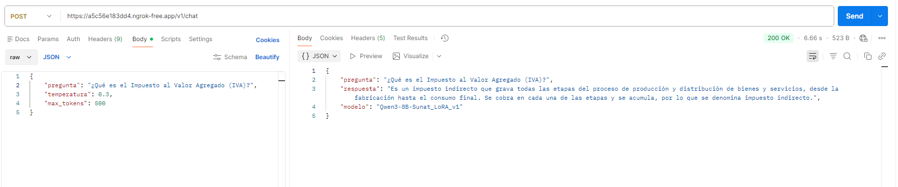

# 🤖 Chatbot SUNAT - Qwen & Unsloth

Este proyecto implementa un chatbot inteligente especializado en consultas de la SUNAT, utilizando el modelo **Qwen3-8B** optimizado con **Unsloth** para un fine-tuning eficiente (LoRA) y capacidades de clonación de voz (TTS).

El proyecto debe ejecutarse en **Google Colab**, aprovechando su GPU gratuita.

## 📂 Estructura del Proyecto

```
ApiChatbotSunat/
│
├── notebooks/
│   ├── Proyecto_Q&A_Sunat_FineTuning_v1.ipynb  # Notebook para entrenar el modelo
│   └── Proyecto_Q&A_Sunat_Aplicacion_v1.ipynb  # Notebook para desplegar la API y el Chat
│
├── src/
│   └── app/
│       ├── api_qa_sunat.py      # Script principal de la API (FastAPI + Modelo)
│       └── referencia_peru.wav  # Archivo de audio de referencia para TTS (Opcional si se carga manual)
│
├── data/
│   └── dataset_finetuning.jsonl # Dataset de preguntas y respuestas para entrenamiento
│
└── README.md
```

## 🚀 Instrucciones para Google Colab

### A. Fine-Tuning del Modelo

Este paso es necesario para crear el adaptador LoRA con el conocimiento de la SUNAT.

1. Abre `Proyecto_Q&A_Sunat_FineTuning_v1.ipynb` en Google Colab.
2. Asegúrate de estar conectado a una **Runtime con GPU** (T4 es suficiente).
3. Sube el archivo `dataset_finetuning.jsonl` a la raíz del entorno de Colab (`/content/`).
4. Ejecuta todas las celdas secuencialmente.
5. Al finalizar, el modelo entrenado se guardará en tu Google Drive bajo la ruta definida (por defecto: `Modelos_Qwen/Sunat_LoRA_v1`).

### B. Ejecución de la Aplicación (API y Chat)

Este notebook levanta una API FastAPI y expone el servicio mediante **ngrok**.

1. Abre `Proyecto_Q&A_Sunat_Aplicacion_v1.ipynb` en Google Colab.
2. Conéctate a una **Runtime con GPU**.
3. **Mount Drive**: Ejecuta la celda para montar Google Drive. Esto es CRÍTICO porque el script busca el modelo entrenado en tu Drive:
   - Ruta esperada: `/content/drive/My Drive/Modelos_Qwen/Sunat_LoRA_v1`
4. **Carga de Archivos**:
   Debes subir los archivos `api_qa_sunat.py` y `referencia_peru.wav` en Colab para que el script funcione correctamente.
   
   Estructura requerida en Colab:
   ```
   /content/
   ├── referencia_peru.wav 
   └── api_qa_sunat.py
   ```
   
   > **Nota Importante**: Si ya dispone del archivo comprimido Sunat_LoRA_v1.zip, puede cargarlo directamente para su uso; no es necesario entrenar nuevamente el modelo.

5. **Clonación de Voz (TTS)**:
   El archivo `api_qa_sunat.py` espera encontrar un audio de referencia en `/content/referencia_peru.wav`. Asegúrate de subirlo a la raíz de Colab.

6. **Ejecución**:
   Ejecuta las celdas. La última celda iniciará el servidor y te proporcionará una **URL pública de ngrok** (ej. `https://xxxx.ngrok-free.app`).

## 📡 Uso de la API

Una vez iniciada la API en Colab, puedes interactuar con ella:

- **Swagger UI**: `{URL_NGROK}/docs`
- **Chat Texto**: `POST {URL_NGROK}/v1/chat`
  ```json
  {
    "pregunta": "¿Qué es el Impuesto al Valor Agregado (IVA)?",
    "temperatura": 0.3,
    "max_tokens": 512
  }
  ```
   
- **Chat Voz**: `POST {URL_NGROK}/v1/chat/audio`
   <p align="center">
  <audio controls>
    <source src="resp_7c862091-4297-4415-9c73-925288083f5d.wav" type="audio/mpeg">
  </audio>
</p>
---
